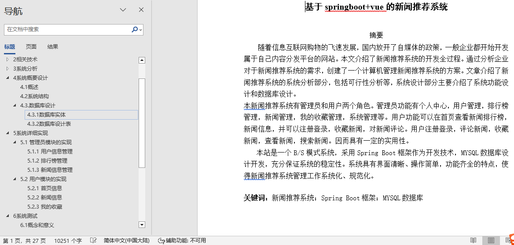
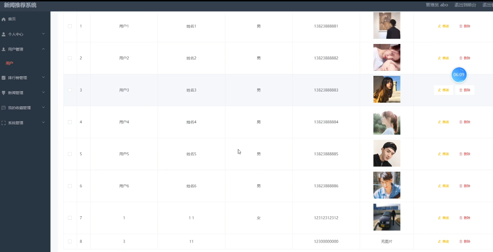
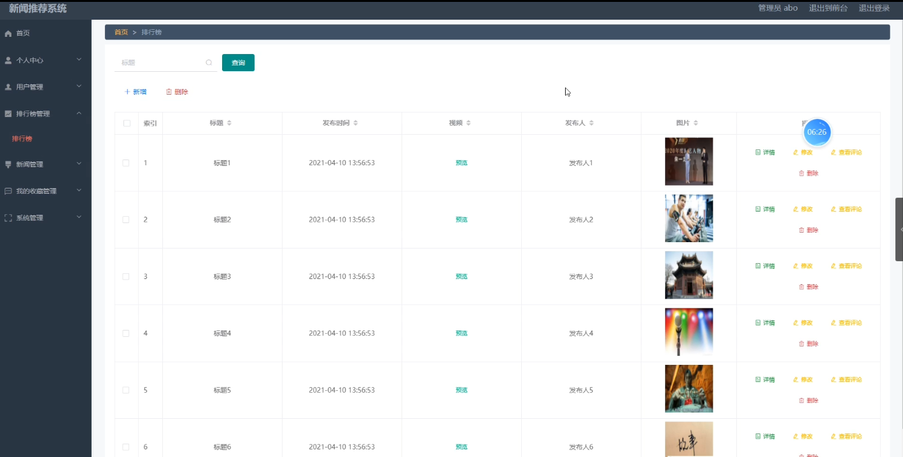
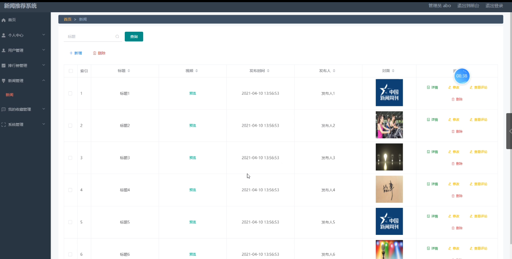
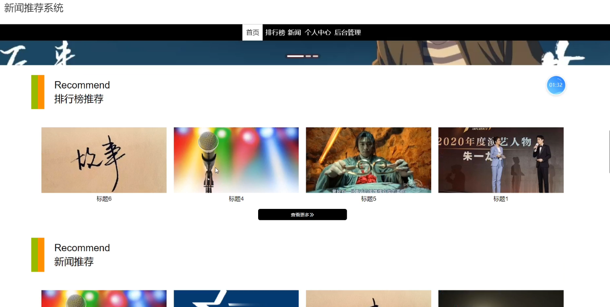

## 新闻推荐系统(程序+报告)

###  获取sql数据库文件: 从戎源码网 (https://armycodes.com/) QQ: 386869957 QQ群: 377586148
###  所有系统地址: (https://github.com/YuLin-Coder/AllProjectCatalog) 
###  所有项目以及源代码本人均调试运行无问题 可支持远程安装部署调试、定制修改、代码讲解

## 项目介绍
新闻推荐系统，系统包含两种角色：用户、管理员，系统分为前台和后台两大模块，主要功能如下：

1 管理员模块的实现

用户信息管理
新闻推荐系统的系统管理员可以对用户信息进行添加、修改、删除操作。

排行榜管理
系统管理员可以对排行榜进行手动管理，包括添加、删除、修改操作。

新闻信息管理
系统管理员可以对新闻信息进行添加、修改、删除操作。

2 用户模块的实现

首页信息
用户登录后，可以在首页查看排行榜推荐和新闻推荐信息。

新闻信息
用户登录后，点击首页中的新闻，可以查看新闻界面，并且新闻界面支持分页显示。

我的收藏
用户登录后可以在个人中心的“我的收藏”中查看自己收藏的新闻信息。

## 项目技术
- 编程语言：Java
- 数据库：MySQL
- 项目管理工具：Maven
- 前端技术：HTML、CSS、JavaScript、Vue
- 后端技术：Spring、SpringMVC、MyBatis

## 运行环境
- JDK版本：JDK1.8及以上
- 开发工具：IDEA、Ecplise、Myecplise都可以
- 数据库: MySQL5.7及以上
- Maven：maven3.0及以上
- Node：14.14.0及以上

## 运行截图

